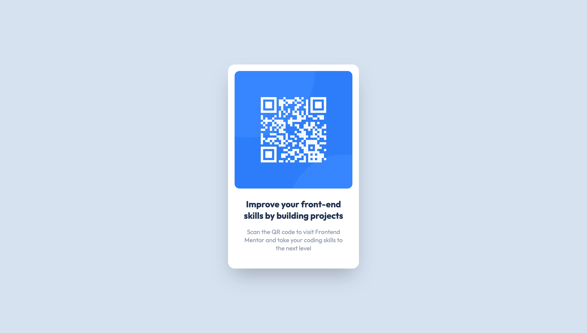

# Frontend Mentor Challenges

A mono repository for my solutions to the [Frontend Mentor](https://www.frontendmentor.io/challenges) challenges. All submitted solutions are also available [here](https://www.frontendmentor.io/profile/n0rrman/solutions), on my Frontend Mentor profile.

The challenges are solved using [Next.js](https://nextjs.org/), [Tailwind CSS](https://tailwindcss.com/), and [TypeScript](https://www.typescriptlang.org).

---

<!-- 🔴Guru 🟠Advanced 🟡Intermediate 🟢Junior 🔵Newbie -->

| Challenge | Level | Repository | Live version | Screenshot |
|-----------|-------|------------|--------------|------------|
| QR code component | 🔵Newbie | [qr-code-component](https://github.com/n0rrman/frontend-mentor-challenges/tree/main/qr-code-component) | [Vercel](https://qr-code-component-chi-five.vercel.app) |  |