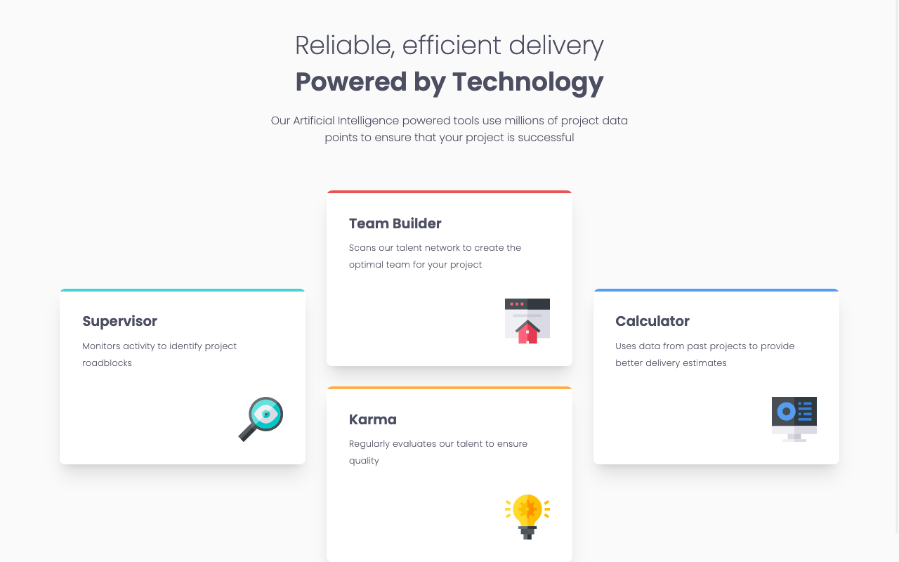

# Frontend Mentor - 3-column preview card component solution

This is a solution to the [Four card feature section challenge on Frontend Mentor](https://www.frontendmentor.io/challenges/four-card-feature-section-weK1eFYK).

### Screenshot

### Links

- Solution URL: [Solution at Frontend Mentor](https://www.frontendmentor.io/solutions/four-card-feature-section-tailwind-and-nextjs-L61hyCEEkk)
- Live Site URL: [Live version on Vercel](https://four-card-feature-section-eta-lemon.vercel.app/)

### Built with

- [Next.js](https://nextjs.org/) - JavaScript framework
- [Tailwind CSS](https://tailwindcss.com/) - CSS framework

