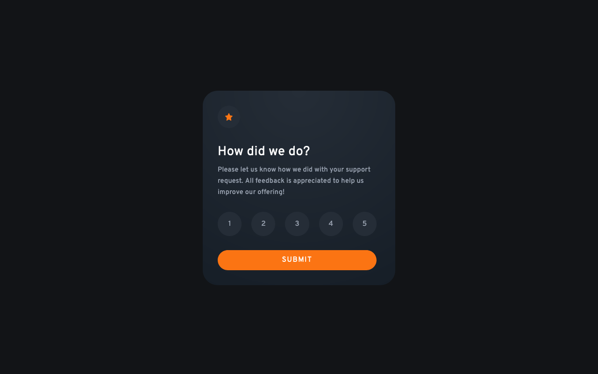

# Frontend Mentor - Interactive rating component solution

This is a solution to the [Interactive rating component challenge on Frontend Mentor](https://www.frontendmentor.io/challenges/interactive-rating-component-koxpeBUmI).

### Screenshot

### Links

- Solution URL: [Solution at Frontend Mentor](https://www.frontendmentor.io/solutions/interactive-rating-component-tailwind-and-nextjs-sH2V9JEZwr)
- Live Site URL: [Live version on Vercel](https://interactive-rating-component-eta-silk.vercel.app)

### Built with

- [Next.js](https://nextjs.org/) - JavaScript framework
- [Tailwind CSS](https://tailwindcss.com/) - CSS framework

