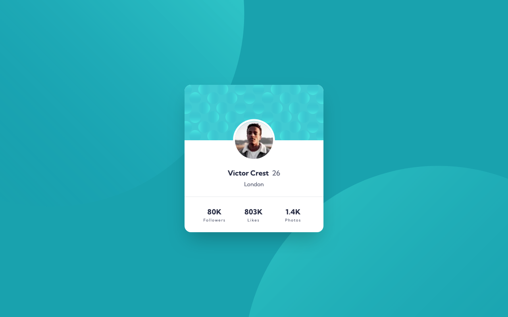

# Frontend Mentor - Profile card component solution

This is a solution to the [Profile card component challenge on Frontend Mentor](https://www.frontendmentor.io/challenges/profile-card-component-cfArpWshJ).  

### Screenshot

### Links

- Solution URL: [Solution at Frontend Mentor](https://www.frontendmentor.io/solutions/profile-card-component-tailwind-and-nextjs-8-6Lbm-WTc)
- Live Site URL: [Live version on Vercel](https://profile-card-component-nine-bice.vercel.app/)

### Built with

- [Next.js](https://nextjs.org/) - JavaScript framework
- [Tailwind CSS](https://tailwindcss.com/) - CSS framework

