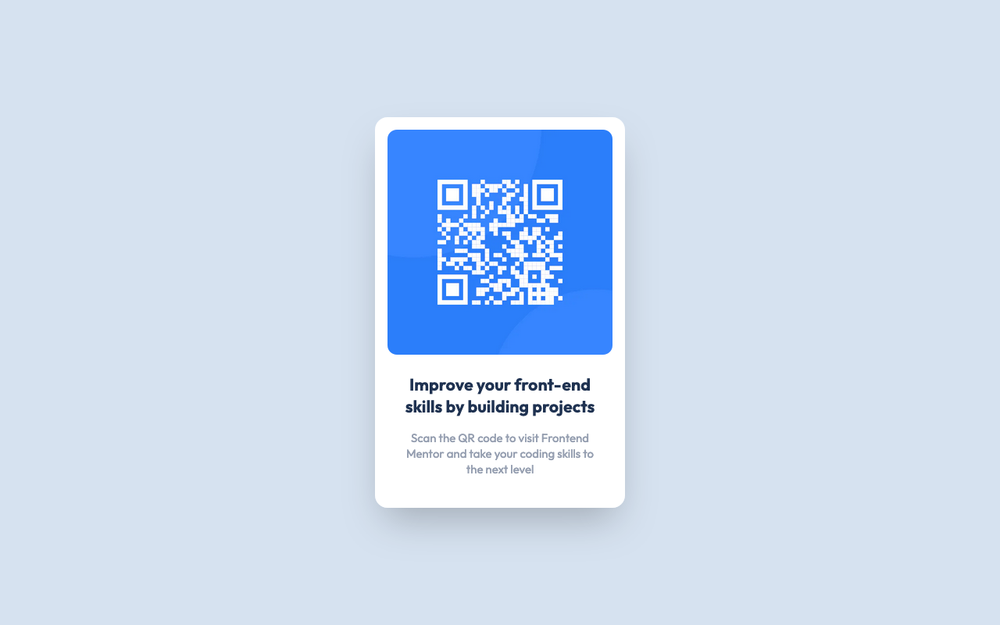

# Frontend Mentor - QR code component solution

This is a solution to the [QR code component challenge on Frontend Mentor](https://www.frontendmentor.io/challenges/qr-code-component-iux_sIO_H). Frontend Mentor challenges help you improve your coding skills by building realistic projects. 

### Screenshot

### Links

- Solution URL: [GitHub repository](https://github.com/n0rrman/frontend-mentor-challenges/tree/main/qr-code-component)
- Live Site URL: [Live version on Vercel](https://qr-code-component-chi-five.vercel.app)

### Built with

- [Next.js](https://nextjs.org/) - JavaScript framework
- [Tailwind CSS](https://tailwindcss.com/) - CSS framework

