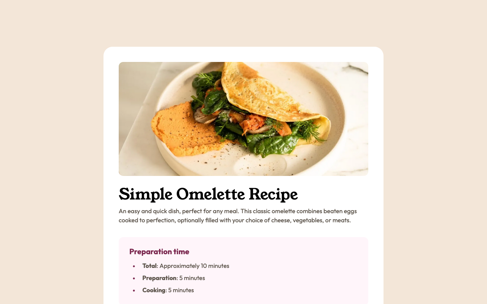

# Frontend Mentor - Recipe page solution

This is a solution to the [Recipe page challenge on Frontend Mentor](https://www.frontendmentor.io/challenges/recipe-page-KiTsR8QQKm).

### Screenshot

### Links

- Solution URL: [Solution at Frontend Mentor](https://www.frontendmentor.io/solutions/recipe-page-tailwind-and-nextjs-sU3nIsZT8A)
- Live Site URL: [Live version on Vercel](https://recipe-page-ashen.vercel.app)

### Built with

- [Next.js](https://nextjs.org/) - JavaScript framework
- [Tailwind CSS](https://tailwindcss.com/) - CSS framework

